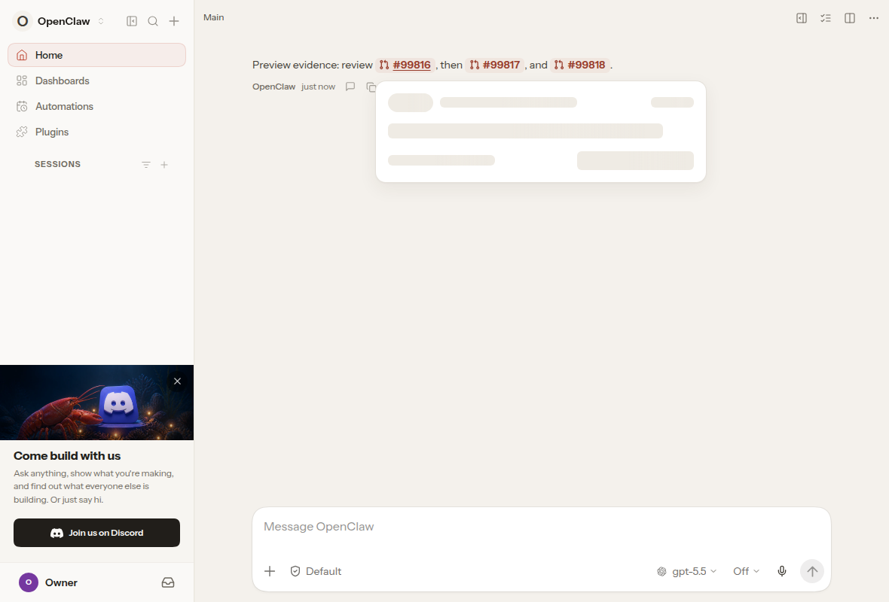
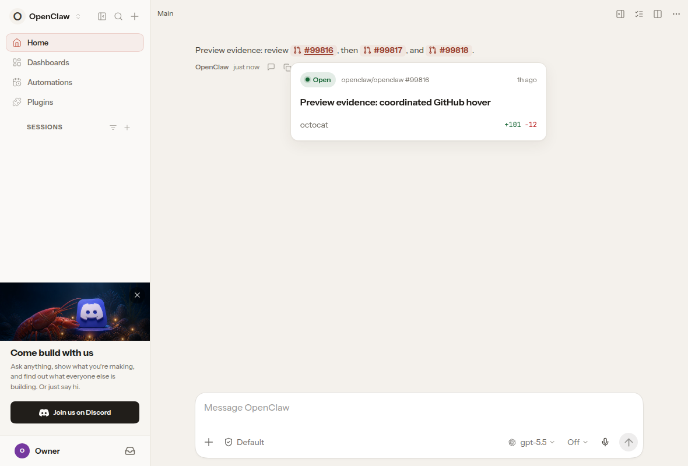
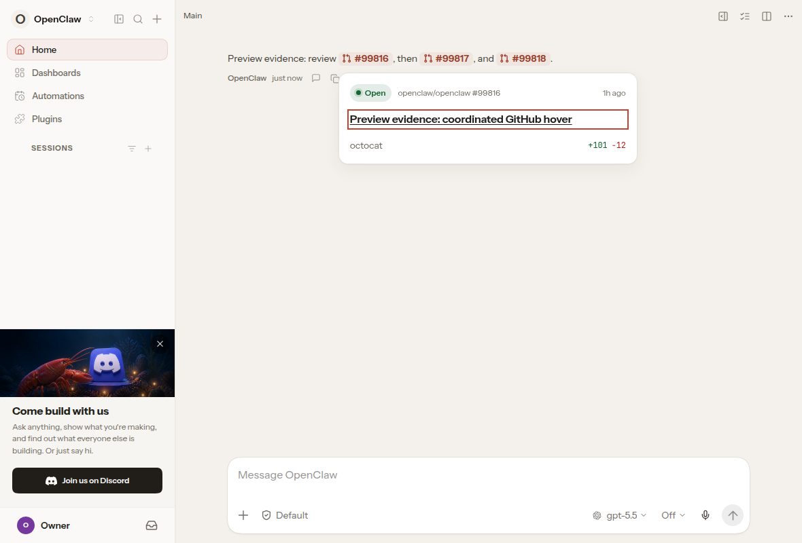
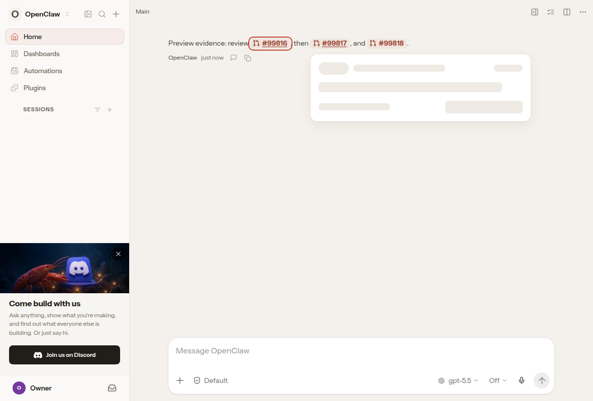
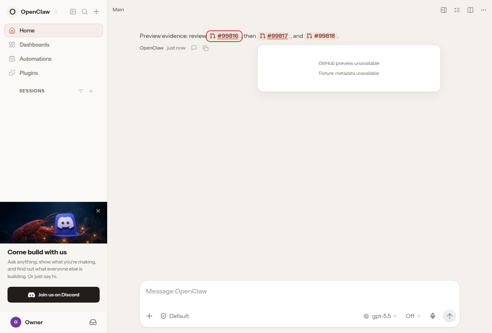
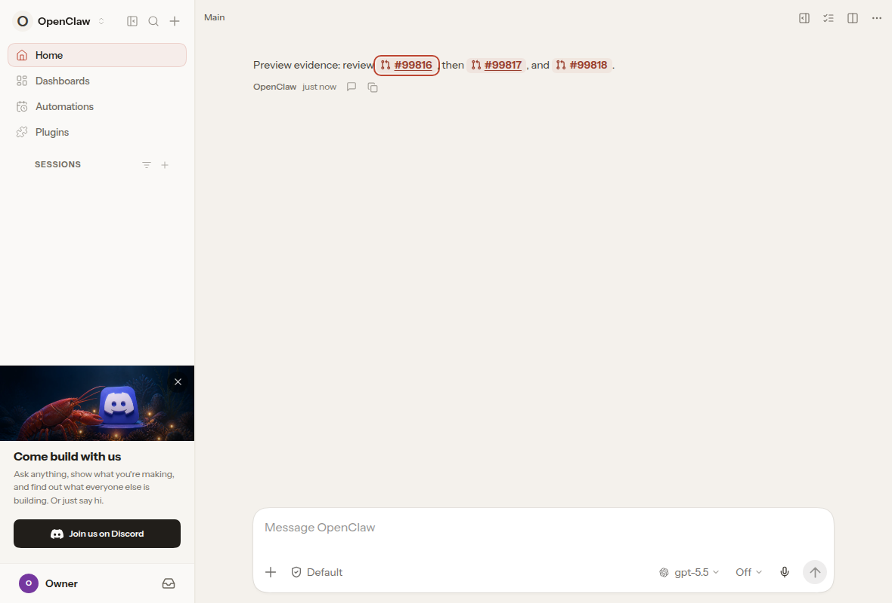

# Inspected GitHub preview evidence — PR #141896

Before SHA: fdd6acecfe91af913e044736e54ddc4cf0dfc908. After SHA: d57b7966d6ba3776099d25ad4ac1dbb6b4173150. Actual production-config UI bundles, same /chat route, light theme, 1180x800 viewport, en-US, Chromium 151.0.7922.34. Fixed fixture date July 5, 2026. Gateway and GitHub metadata are controlled fixtures, not live GitHub data.

All 14 full-resolution frames were pixel-inspected in the parent review session. No visible secrets/private contacts/unrelated conversations, clipping, or obscured targets were found. Nine unique PNG payloads represent the 14 captured states; exact duplicates are intentional and recorded by SHA256.

| Stage | Original baseline | Reviewed head |
|---|---|---|
| cold-title |  |  |
| initial-pending |  |  |
| success-hover |  |  |
| success-focus |  |  |
| later-loading |  |  |
| failure-dismissal |  |  |
| cached-failure |  |  |

The first request stays silent on head; later uncached links retain the loader after a displayed success. Failure and cached-failure cards disappear. Successful hover and keyboard-focus screenshots are byte-identical across versions. Keyboard assertions traversed repo link then title with Tab and opened the expected GitHub URL using Enter; the destination response was explicitly intercepted to a synthetic page.

The timeline in provenance.json records observed state and elapsed wall time including startup. The cold runtime and first metadata response were deliberately held; screenshots alone do not prove timing. Repeated silent/error frames are not distinct animation proof. Browser destination/status chrome is outside these viewport captures; href and navigation remain unchanged. Uninspected recordings are not included.

This is an evidence-only update. No product code, product-branch commit, proxy/safety setting, merge, or deployment was changed. This evidence-only branch stores the inspected packet independently. The separate required autoreview helper proxy-preflight limitation remains disclosed in the PR.

Worked on by:
- @RomneyDa
