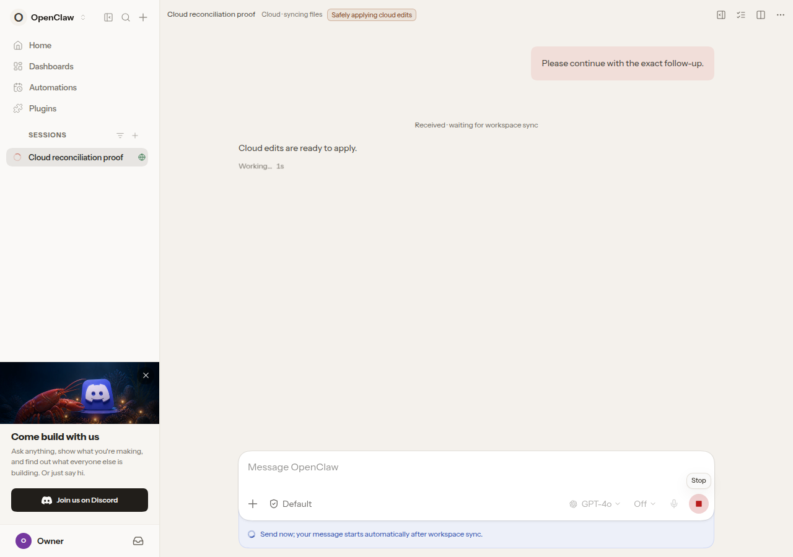
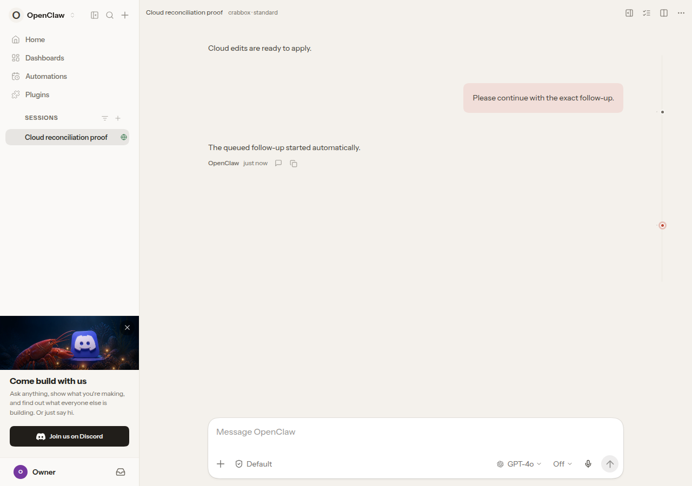
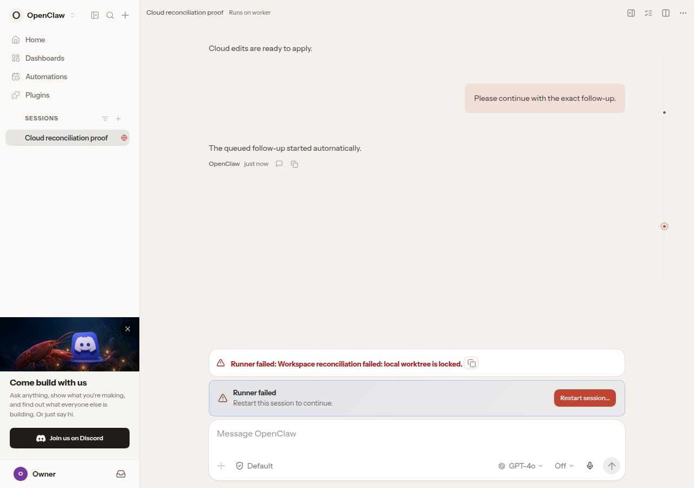

# PR 137576 Control UI proof

Captured from source `bd03e3cc226f794452488bce5396ab772914c3cf` in Chromium on 2026-09-08.

These are unaltered screenshots of the built Control UI using synthetic mocked Gateway responses. They demonstrate UI presentation and transitions, not live cloud execution or exactly-once backend delivery. Gateway admission regressions separately cover the owner behavior. No credentials, private workspace content, or personal conversations are included. The fixture uses the public GPT-4o model label and does not invoke a model.

## Before reconciliation completes

One submitted message has a durable waiting receipt; the healthy sync status and send guidance are visible.



## After reconciliation completes

The same message appears once, the waiting receipt is removed, and the synthetic assistant response is shown after the mocked run completes.



## True failure

A synthetic workspace-lock failure produces the red failure state and restart action.



## Reproduce

```sh
OPENCLAW_CAPTURE_UI_PROOF=1 OPENCLAW_UI_E2E_ARTIFACT_DIR=/tmp/pr-137576-proof-fixed node scripts/run-vitest.mjs run --config test/vitest/vitest.ui-e2e.config.ts --configLoader runner ui/src/e2e/cloud-reconciliation-followup.e2e.test.ts
```

Result: 1 browser test passed, including one-message assertions during sync and after resume. The source fixture also passed scoped lint and independent P0-P2 autoreview.

## SHA-256

- `01-slow-sync.png`: `623bab1a7b995715ad0450e5e4d8cad90f3f14eee4108afcca7bfac70727b974`
- `02-resumed.png`: `d3f3044472959277335454f8548e59408ac26ec0381623bc84ed4314e149bced`
- `03-true-failure.png`: `3a6b94257dd1c3df444e5356f310de705bd947956d6ece94c1ab025d3996d293`
